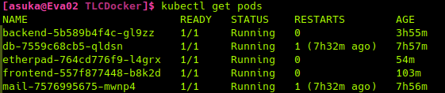
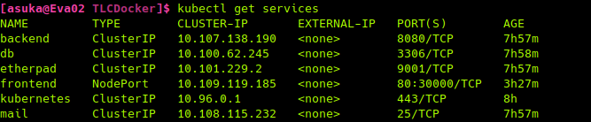
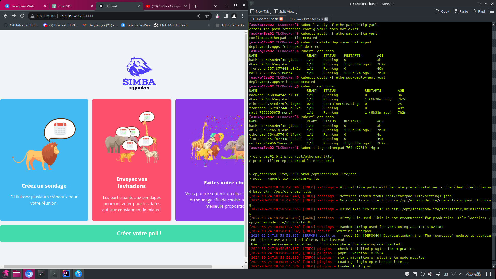
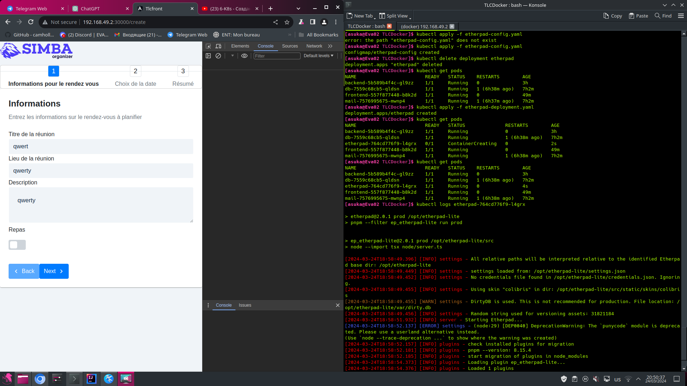
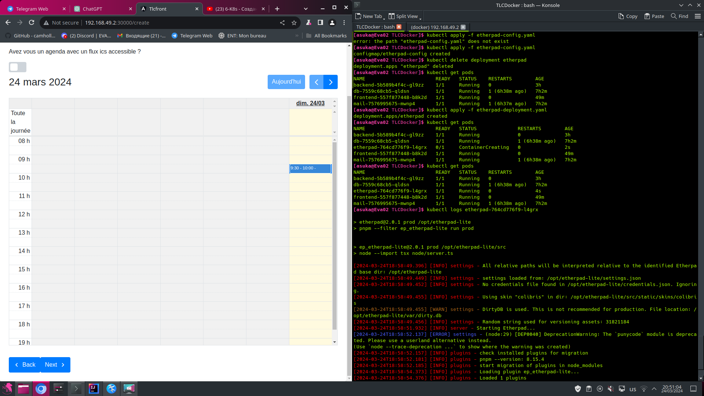
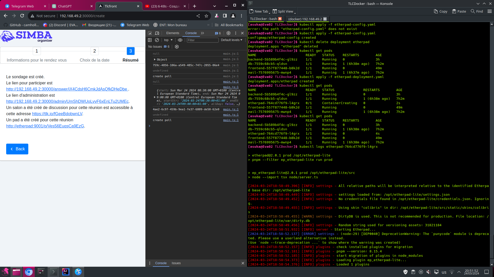

 # Developed by: Oleksii Tkachenko and Kateryna Shcherbakova.

 # The goal of the project is to create an automated chain of deployment of a web application developed using cloud technologies on the infrastructure you manage.

## Objective 1: 
- Simplify deployment with containers
- Simplify configuration during deployment (smtp server to use, notepad connection, etc.)
- Simplify security during deployment

The first step was to create a fork of the project. We created our own branch **https://github.com/LexaProInvoke/doodlestudent** and further changed settings in api/src/main/resources/application.yml file. The changes were mainly for attaching services to ports.

### Instructions for start-up and use. 

- Check your internet connection. 

- Copy the repository to your machine and navigate to the project directory.

``` bash
git clone https://github.com/LexaProInvoke/doodlestudent.git
cd https://github.com/LexaProInvoke/doodlestudent.git
```

 Check if you have docker 

``` bash
docker --version
```

- If Docker is not installed, download and install it.

```bash
sudo apt update
sudo apt install docker.io
sudo systemctl start docker
sudo systemctl enable docker
```

- Launch the application with the command 

``` bash
docker-compose up

```

- Go to *http://localhost:4200* in your browser

### The job was to write the docker files, the docker-compose file, and the nginx file.

### DockerfileBack

```Dockerfile
# Use Maven image as a builder stage
FROM maven:3.9.6-amazoncorretto-21 as builder
# Set working directory for the project
WORKDIR /project
# Update package repository and install git
RUN yum update && yum install git -y
# Clone the git repository with the project source code
RUN git clone https://github.com/LexaProInvoke/doodlestudent.git
# Navigate to the project directory
WORKDIR /project/doodlestudent/api
# Build the project using Maven, creating an uber-jar package
RUN mvn clean package -Dquarkus.package.type=uber-jar
# Use Amazon Corretto image for the final stage
FROM amazoncorretto:21
# Set working directory for the project
WORKDIR /project
# Copy the built uber-jar from the builder stage to the final image
COPY --from=builder /project/doodlestudent/api/target/tlcdemoApp-1.0.0-SNAPSHOT-runner.jar run.jar
# Command to run the application (sleep for 30 seconds before starting the Java application to allow time for other services to initialize)
CMD ["sh", "-c", "sleep 30 && java -jar run.jar"]
```

### DockerfileFront

```Dockerfile
# Stage 1: Build the frontend assets
FROM node:20.11.1-alpine AS build
# Set the working directory for the project
WORKDIR /project
# Install git to clone the repository
RUN apk update && apk add git
# Clone the repository containing the frontend code
RUN git clone https://github.com/LexaProInvoke/doodlestudent.git
# Navigate to the frontend directory
WORKDIR /project/doodlestudent/front
# Install dependencies using npm
RUN npm install
# Build the frontend assets
RUN npm run build
# Stage 2: Serve the built assets using nginx
FROM nginx:1.25.4-alpine
# Copy custom nginx configuration file
COPY nginx.conf /etc/nginx/nginx.conf
# Copy the built frontend assets from the build stage to the nginx html directory
COPY --from=build /project/doodlestudent/front/dist/tlcfront /usr/share/nginx/html
```
To run multiple dockerfiles at once we wrote docker-compose.yaml.

```yaml
version: "3.8"

services:
  # Configuration for the MySQL database service.
  db:
    image: mysql
    ports:
      - "3306:3306"
    environment:
      - MYSQL_ROOT_PASSWORD=root
      - MYSQL_DATABASE=tlc
      - MYSQL_USER=tlc
      - MYSQL_PASSWORD=tlc

  # Configuration for the Etherpad service.
  etherpad:
    image: etherpad/etherpad
    ports:
      - "9001:9001"
    volumes:
      - ./APIKEY.txt:/opt/etherpad-lite/APIKEY.txt  # Mounts APIKEY.txt into the Etherpad container

  # Configuration for the mail service.
  mail:
    image: bytemark/smtp
    restart: always
    ports:
      - "2525:25"

  # Configuration for the backend service.
  backend:
    image: oleksiiback:latest
    build:
      context: .
      dockerfile: DockerfileBack  # Specifies the Dockerfile for building the backend image
    container_name: oleksiiback
    environment:
      ETHERPAD_HOST: etherpad  # Sets environment variables for backend service
      MESSAGE_DB_HOST: db
      MAILER_HOST: mail
    depends_on:
      - db
      - etherpad
      - mail
    ports:
      - "8080:8080"

  # Configuration for the frontend service.
  frontend:
    image: oleksiifront:latest
    build:
      context: .
      dockerfile: DockerfileFront  # Specifies the Dockerfile for building the frontend image
    container_name: oleksiiFront
    depends_on:
      - backend  # Specifies that the frontend service depends on the backend service
    ports:
      - "4200:4200"

```

The nginx.conf file was written to connect request routing
It defines the web server and its behaviour when processing requests


``` nginx
events{}
http {
    # Include MIME types from the specified file.
    include /etc/nginx/mime.types;
    # Define a server block listening on port 4200.
    server {
        listen 4200;
        # Server name is set to localhost.
        server_name localhost;
        # Set the root directory from which to serve files.
        root /usr/share/nginx/html;
        # Specify the default file to serve when a directory is requested.
        index index.html;
        # Define how nginx handles requests to the root location.
        location / {
            # Try serving the requested URI, then try with the URI plus a slash, finally fall back to serving index.html.
            try_files $uri $uri/ /index.html;
        }

        # Define a location block for handling requests to '/api'.
        location /api {
            # Set HTTP headers for proxying the request.
            proxy_set_header X-Real-IP $remote_addr;
            proxy_set_header X-Forwarded-For $proxy_add_x_forwarded_for;
            proxy_set_header X-NginX-Proxy true;
            # Pass the request to the backend server.
            proxy_pass http://backend:8080/api;
            # Disable redirecting responses from the backend.
            proxy_redirect off;
            # Set the Host header to the value of the Host header received from the client.
            proxy_set_header Host $host;
        }
    }
}
```

As a result, to deploy a client server application on one computer, there are 5 files in the repository (APIKEY.txt, docker-compose.yaml, DockerfileBack, DockerfileFront, nginx.conf) inside the docker files there are links to repositories with the main code that is downloaded automatically.  

Добавить  схему работы """""""""""""""""""""


## Задание 2

Now we want to use kubernetes to deploy all the microservices. The goal is to be able to compare and understand the additional abstractions provided by kubernetes compared to simply deploying the application on a single node using docker and docker-compose. In particular, we want to add redundancy to the back-end of the application (redundancy only on this microservice). Especially not on the relational database, as it is more complicated and not quite transparent). So deploy microk8s on your virtual machine.
Use kubernetes to set up minimal redundancy for the back end of the application (we won't cluster the database initially).


For this task we had to upload images of docker files for frontend and backend on docker hub you can download them from this link.
 **https://hub.docker.com/repository/docker/oleksiid0cker/tlc_oleksii_kateryna/general**

The local minikube cluster **https://minikube.sigs.k8s.io/docs/** was used to run the kubernetes cluster


As a result, a different code was written for each service:

backend-deployment.yaml

```yaml
apiVersion: apps/v1
kind: Deployment
metadata:
  name: backend
spec:
  # Set the number of replicas to 3 for redundancy
  replicas: 3
  selector:
    matchLabels:
      app: backend
  template:
    metadata:
      labels:
        app: backend
    spec:
      # Define the Pod template for the Deployment
      containers:
      - name: backend
        # Use the specified Docker image
        image: oleksiid0cker/tlc_oleksii_kateryna:latest
        ports:
        - containerPort: 8080
        # Specify environment variables for the container
        env:
        - name: ETHERPAD_HOST
          value: etherpad
        - name: MESSAGE_DB_HOST
          value: db
        - name: MAILER_HOST
          value: mail

# Define a Service to expose the backend application within the cluster
apiVersion: v1
kind: Service
metadata:
  name: backend
spec:
  selector:
    app: backend
  ports:
    - protocol: TCP
      port: 8080
      targetPort: 8080
  # Specify the type of Service as ClusterIP (accessible only within the cluster)
  type: ClusterIP
```

frontend-deployment.yaml

```yaml
apiVersion: apps/v1
kind: Deployment
metadata:
  name: frontend  # Define a Deployment named frontend
spec:
  replicas: 1  # Set the number of replicas to 1
  selector:
    matchLabels:
      app: frontend  # Select Pods with the label "app: frontend"
  template:
    metadata:
      labels:
        app: frontend  # Label Pods with "app: frontend"
    spec:
      containers:
      - name: frontend
        image: oleksiid0cker/tlc_oleksii_kateryna:front  # Use the specified Docker image for the frontend container
        ports:
        - containerPort: 4200  # Expose port 4200 on the container
        env:
        - name: BACKEND_URL  # Environment variable for the backend address
          value: "http://10.107.138.190:8080"  # Specify the static address of your backend
---
apiVersion: v1
kind: Service
metadata:
  name: frontend  # Define a Service named frontend
spec:
  type: NodePort  # Expose the Service using a NodePort
  selector:
    app: frontend  # Select Pods with the label "app: frontend"
  ports:
    - protocol: TCP
      port: 80  # Expose port 80 externally
      targetPort: 4200  # Route traffic to port 4200 on the Pods
      nodePort: 30000  # Specify the NodePort to use for external access

```

db-deployment.yaml

```yaml
# Define a Deployment for the database
apiVersion: apps/v1
kind: Deployment
metadata:
  name: db
spec:
  # Set the number of replicas to 1
  replicas: 1
  # Define how Pods are selected for management
  selector:
    matchLabels:
      app: db
  # Define the Pod template
  template:
    metadata:
      # Label Pods with "app: db"
      labels:
        app: db
    spec:
      # Define the container(s) within the Pod
      containers:
      - name: db
        # Use the mysql Docker image
        image: mysql
        ports:
        - containerPort: 3306
        # Specify environment variables for the container
        env:
        - name: MYSQL_ROOT_PASSWORD
          value: root
        - name: MYSQL_DATABASE
          value: tlc
        - name: MYSQL_USER
          value: tlc
        - name: MYSQL_PASSWORD
          value: tlc

# Define a Service to expose the database within the cluster
apiVersion: v1
kind: Service
metadata:
  name: db
spec:
  # Select Pods with the "app: db" label
  selector:
    app: db
  # Expose port 3306
  ports:
    - protocol: TCP
      port: 3306
      targetPort: 3306
```

etherpad-deployment.yaml

```yaml
apiVersion: apps/v1
kind: Deployment
metadata:
  name: etherpad  # Define a Deployment named etherpad
spec:
  replicas: 1  # Set the number of replicas to 1
  selector:
    matchLabels:
      app: etherpad  # Select Pods with the label "app: etherpad"
  template:
    metadata:
      labels:
        app: etherpad  # Label Pods with "app: etherpad"
    spec:
      containers:
        - name: etherpad
          image: etherpad/etherpad  # Use the specified Docker image for the etherpad container
          ports:
            - containerPort: 9001  # Expose port 9001 on the container
          volumeMounts:
            - mountPath: /opt/etherpad-lite/APIKEY.txt  # Mount the API key file
              name: api-key-volume  # Name of the volume to mount
              subPath: APIKEY.txt  # Specify the file within the volume
      volumes:
        - name: api-key-volume  # Define a volume named api-key-volume
          configMap:
            name: etherpad-config  # Use the ConfigMap named etherpad-config for the volume data
```

mail-deployment.yaml

```yaml
apiVersion: apps/v1
kind: Deployment
metadata:
  name: mail  # Define a Deployment named mail
spec:
  replicas: 1  # Set the number of replicas to 1
  selector:
    matchLabels:
      app: mail  # Select Pods with the label "app: mail"
  template:
    metadata:
      labels:
        app: mail  # Label Pods with "app: mail"
    spec:
      containers:
      - name: mail
        image: bytemark/smtp  # Use the specified Docker image for the mail container
        ports:
        - containerPort: 25  # Expose port 25 on the container
---
apiVersion: v1
kind: Service
metadata:
  name: mail  # Define a Service named mail
spec:
  selector:
    app: mail  # Select Pods with the label "app: mail"
  ports:
    - protocol: TCP
      port: 25  # Expose port 25 externally
      targetPort: 25  # Route traffic to port 25 on the Pods
```

etherpad-config.yaml

```yaml
apiVersion: v1
kind: ConfigMap
metadata:
  name: etherpad-config
data:
  APIKEY.txt: "19d89ca52bc0fa4f19d6325464d9d7a032649b9fa68c111514627081e2784b4a"
```

There were 6 files written to run the application on the cluster "backend-deployment.yaml, frontend-deployment.yaml, db-deployment.yaml, etherpad-deployment.yaml, mail-deployment.yaml, config.yml, etherpad-config.yaml". 

## To run an application on a cluster, the following actions must be performed:

- Install and run a local minikube cluster

```bash
brew install minikube
curl -LO https://storage.googleapis.com/minikube/releases/latest/minikube-linux-amd64
sudo install minikube-linux-amd64 /usr/local/bin/minikube
minikube start
```
- Copy the project repository to your computer 

```bash
git clone https://github.com/LexaProInvoke/doodlestudent.git
cd https://github.com/LexaProInvoke/doodlestudent.git
```
- Run the configuration files using the commands  

``` bash
kubectl apply -f <filename>
```
- Open your browser and follow the link *http://192.168.49.2:30000*

#### The following commands were used for development:

```bash 

# Display logs from the etherpad Pod with the specific name (example: etherpad-764cd776f9-l4grx)
kubectl logs etherpad-764cd776f9-l4grx

# Check the status of Minikube cluster
minikube status

# Start Minikube cluster
minikube start

# Describe the details of a specific Pod named backend-679cf49fcc-mhpmt
kubectl describe pod backend-679cf49fcc-mhpmt

# Apply the configuration defined in the YAML file db-deployment.yaml to create or update resources
kubectl apply -f db-deployment.yaml

# Apply the configuration defined in a YAML file with a specific filename
kubectl apply -f <filename>

# Load Docker images from the specified file path
docker@minikube:~$ docker load -i /home/docker/images

# SSH into the Minikube virtual machine using the private key and IP address
ssh -i ~/.minikube/machines/minikube/id_rsa docker@192.168.49.2

# Delete a Pod with a specific name (example: mail-7576995675-xsnk9)
kubectl delete pod mail-7576995675-xsnk9

# Delete a Deployment with a specific name
kubectl delete deployment <name>

# Get a list of Deployments in the Kubernetes cluster
kubectl get deployments

# Start Docker containers defined in the Docker Compose file in detached mode
docker-compose up --detach

# Check the status of the Docker service
sudo systemctl status docker

# Start the Docker service
sudo systemctl start docker
```

List of all Pods 



List of all Services running in the project 



Example of programme operation 








